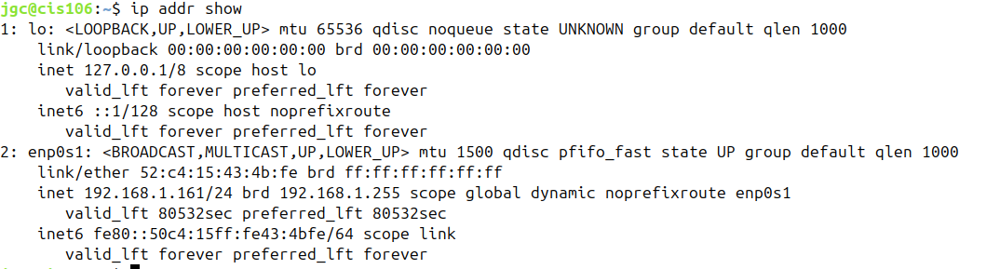
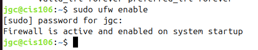
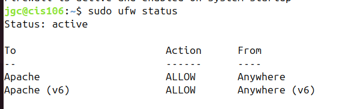
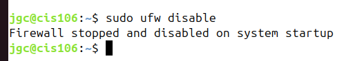
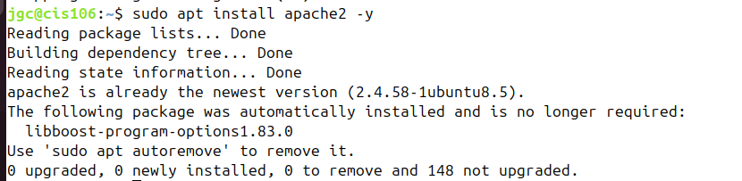
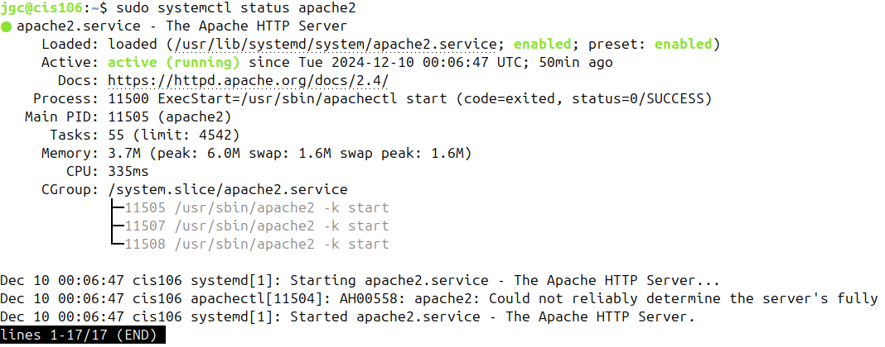
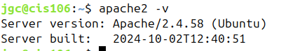
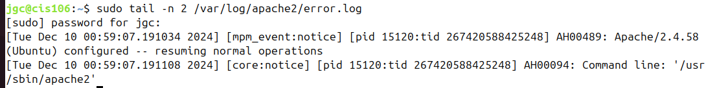

Name: Jenny Garcia-Cuautla
Course: CIS106 
Semester: Fall 24

## What is the IP address of your Ubuntu Server Virtual Machine?
* ip addr show

## How do you enable the Ubuntu Firewall?
* sudo ufw enable

## How do you check if the Ubuntu Firewall is running?
* sudo ufw status

## How do you disable the Ubuntu Firewall?
* sudo ufw disable

## How do you add Apache to the Firewall?
* sudo ufw allow 'Apache'

## What is the command you used to install Apache?
* sudo apt install apache2 -y

## What is the command you use to check if Apache is running?
* sudo systemctl status apache2

## What is the command you use to stop Apache?
* sudo systemctl stop apache2

## What is the command you use to restart Apache?
* sudo systemctl restart apache2

## What is the command used to test Apache configuration?
* sudo apache2ctl configtest

## What is the command used to check the installed version of Apache?
* apache2 -v

## What are the most common commands to troubleshoot Apache errors? Provide a brief description of each command.

1. Check Apache's service status
**Command**: sudo systemctl status apache2
**Description**: Displays whether Apache is running or stopped and shows any recent issues with the service.

2. Test Apache configuration for errors
**Command**: sudo apachectl configtest
**Description**: Checks Apache's configuration files for syntax errors.

3. Check Apache's error logs
**Command**: sudo tail -n 10 /var/log/apache2/error.log
**Description**: Shows the last 10 entries in the error log

4. Restart Apache service
**Command**: sudo systemctl restart apache2
**Description**: Restarts the Apache service to apply configuration changes or recover from errorss. 

5. View system logs for Apache
**Command**: sudo journalctl -u apache2
**Description**: Displays systemd logs specifically related to Apache.

## Which are Apache Log Files, and what are they used for? Provide examples and screenshots.
* Apache log files are a very helpful resource for troubleshooting. Apache will also output errors related to configuration, built-in modules, and other debugging information to its log files.
**Example**: to view the last two lines of the error log using tail

